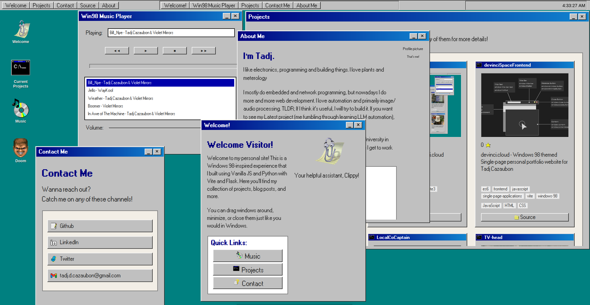

# Devinci.Space

This is the server and database and API components of my personal portfolio website, [devinci.space](https://devinci.space). This site is kept behind an Nginx reverse proxy and hosted locally.

The site is modeled after a Windows 98 desktop, complete with a start menu, taskbar, and desktop icons. Styling for the windows components is done using the [98.css](https://jdan.github.io/98.css/) package for consistency. 

The frontend component of the site is a custom window manager bundled using Vite. That's available [here](https://github.com/sudoDeVinci/devinci.cloud-frontend).

## Flask Server

A minimal Flask app using SQLite.
There is also support for async integration with Github for updates and interactions with relevant repos. To make the most of the lackluster server hardware on which this is all hosted.
